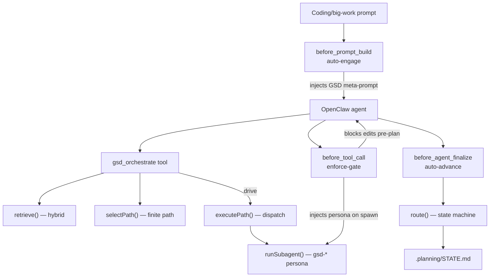
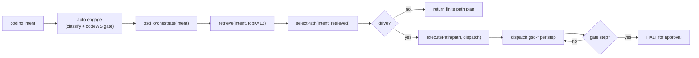

<!-- generated-by: gsd-doc-writer -->
# Architecture

GSD-OC is a **native OpenClaw plugin** that ports the GSD (Get Shit Done)
methodology — research → codebase-map → plan → execute → verify → ship — into
OpenClaw for *any* OpenClaw agent. It auto-engages on coding/big-work prompts,
selects a finite GSD lifecycle path for the intent, and dispatches the matching
ported GSD subagent per step — without the user typing a single slash-command.

It is self-contained: no Claude Code runtime dependency, no `@opengsd/*`
dependency at runtime. The GSD state engine, model catalog, and lock semantics
are reimplemented natively in TypeScript; the upstream `gsd-tools.cjs` /
`state.cjs` / `core.cjs` files are treated as read-only behavioral specs.

## System overview

The plugin is a single `definePluginEntry` entry ([`src/index.ts:88`](../src/index.ts))
that registers, at load time:

- **3 hooks** — `before_prompt_build` (auto-engage), `before_tool_call`
  (enforcement gate + spawn-persona injection), `before_agent_finalize`
  (auto-advance) — plus the internal `agent:bootstrap` hook for robust
  AGENTS-file injection.
- **1 service** — `gsd-oc` lifecycle service (a no-op `start()`; the loop is
  hook-driven, [`src/index.ts:99`](../src/index.ts)).
- **10 tools** — 4 named tools (`gsd_orchestrate`, `gsd_retrieve`,
  `gsd_settings`, `gsd_state`) plus 6 namespace router tools.
- **0 slash commands** — `registerCommand` is never called. Every GSD verb is
  reached through `registerTool` + the 6 routers (resolved by OpenClaw's
  toolSearch), so the surface consumes **zero** of Discord's 100 global
  slash-command slots.



## Module map

```
src/
├── index.ts              Plugin entry: definePluginEntry; registers hooks, service, 10 tools
├── engine/               Native state engine (reimpl of gsd-tools)
│   ├── route.ts          route(planningDir) — pure read-only next-step state machine
│   ├── mutate.ts         setStatus/recordProgress/addDecision/addBlocker — atomic STATE.md writers
│   ├── state.ts          O_EXCL lockfile + readModifyWriteStateMd — atomic RMW core
│   ├── phase.ts          Decimal phase discovery (findPhase / comparePhaseNum)
│   ├── config.ts         .planning/config.json reader + canonical GSD defaults
│   ├── model.ts          Per-agent model-tier catalog (quality/balanced/budget/adaptive)
│   └── commit.ts         Safe git commit helper (add-by-name, never -A, never --no-verify)
├── retrieval/            Hybrid retrieval (the long-tail finder)
│   ├── corpus.ts         Loads corpus.generated.json (251 docs / 3712 chunks)
│   ├── bm25.ts           Pure-TS Okapi BM25 (k1=1.2, b=0.75)
│   ├── trigram.ts        Pure-TS char-trigram Dice similarity (typo/substring tolerance)
│   ├── embed.ts          spark NIM embeddings client (2048-dim, asymmetric query/passage)
│   ├── semantic.ts       embed query → ANN/cosine search the vector backend
│   ├── vectors.ts        LanceDB backend (primary) + brute-force cosine fallback
│   ├── fuse.ts           Reciprocal-rank fusion (RRF, k=60)
│   ├── rollup.ts         Chunk hits → doc/skill-level results
│   ├── manifest.ts       sha256 + merkle content-hash manifest (incremental rebuild)
│   ├── detect.ts         Multi-CLI GSD install detection (build-time only)
│   └── retrieve.ts       The hybrid orchestrator (BM25 + trigram + semantic → RRF → rollup)
├── hooks/
│   ├── auto-engage.ts    before_prompt_build — inject GSD meta-prompt on coding turns
│   ├── enforce-gate.ts   before_tool_call — block pre-plan edits + inject spawn personas
│   └── auto-advance.ts   before_agent_finalize — re-run route(), revise for mechanical steps
├── engage/
│   ├── classify.ts       classifyIntent() — pure work-verb → GSD category classifier
│   ├── opt-out.ts        .gsd-off / pluginConfig / session-toggle opt-out resolution
│   ├── agents-md.ts      mergeGsdSection() — canonical AGENTS.md GSD block merge
│   └── bootstrap-inject.ts  agent:bootstrap handler — own the order-10 AGENTS content
├── orchestrate/
│   ├── select-path.ts    selectPath() — finite GSD path (backbone + conditional long-tail)
│   ├── execute-path.ts   executePath() — dispatch each step, halt at gates / failures
│   └── inject.ts         instructionFor() — bounded revise/enqueue instruction strings
├── dispatch/
│   ├── run-subagent.ts   runSubagent() — code-driven dispatch of one gsd-* persona
│   └── fan-out.ts         multi-lane fan-out helper
├── agents/
│   ├── roster.generated.ts  33 ported gsd-* personas (inlined, no runtime fs read)
│   ├── index.ts          AGENTS registry + resolveAgent (33-agent drift guard)
│   └── types.ts          AgentDefinition shape
├── routers/
│   ├── routers.ts        The 6 namespace router definitions + static intent match
│   └── route-wire.ts     Wires each router's execute() to the authoritative route() engine
├── loop/decide.ts        decideDispatch() — route() result → agent-driven / code-driven / terminal
├── gates/                Discord-native decision-gate builders (modal/select/buttons/poll/resume)
└── state/read-state.ts   STATE.md reader (re-exported by engine/state.ts)
```

## The three pillars

### Pillar 1 — Retrieval (hybrid, long-tail aware)

`gsd_retrieve` and the orchestrator route free-text intent to the relevant GSD
skills/subagents via a hybrid pipeline ([`src/retrieval/retrieve.ts:97`](../src/retrieval/retrieve.ts)).
Three ranked lists are produced and fused:

1. **BM25** — pure-TS Okapi BM25 over chunk text, always available
   ([`src/retrieval/bm25.ts`](../src/retrieval/bm25.ts)).
2. **Trigram** — pure-TS character-trigram Dice similarity for typo/substring
   tolerance, always available ([`src/retrieval/trigram.ts`](../src/retrieval/trigram.ts)).
3. **Semantic** — spark NIM embeddings (`nvidia/llama-nemotron-embed-vl-1b-v2`,
   2048-dim, asymmetric `query`/`passage` `input_type`,
   [`src/retrieval/embed.ts:20`](../src/retrieval/embed.ts)) searched over a
   LanceDB embedded backend, with a brute-force cosine matrix as the never-fail
   fallback ([`src/retrieval/vectors.ts:45`](../src/retrieval/vectors.ts)).

The three lists are combined with **reciprocal-rank fusion** (RRF, k=60,
[`src/retrieval/fuse.ts:9`](../src/retrieval/fuse.ts)). RRF is rank-based so
BM25 scores, Dice ratios, and cosine distances merge without normalization.
Semantic is weighted ×2 ([`src/retrieval/retrieve.ts:82`](../src/retrieval/retrieve.ts)),
tuned via a weight sweep so the long-tail case — e.g. *"the build is flaky"* →
`gsd-debugger`, where "flaky" appears in zero debug-doc chunks — surfaces in the
top results. Fused chunk hits roll up to doc/skill level
([`src/retrieval/rollup.ts`](../src/retrieval/rollup.ts)), each result carrying
its source modalities.

**Graceful degradation:** if spark is unconfigured (`embedAvailable()` false,
[`src/retrieval/embed.ts:49`](../src/retrieval/embed.ts)) or unreachable, fusion
proceeds over BM25 + trigram only — the tool never hard-fails. A `degraded` flag
is surfaced when semantic was configured but no semantic modality reached the
results.

The corpus is a build artifact (`corpus.generated.json`, **251 docs / 3712
chunks**) emitted from the detected GSD install's workflows, agents, references,
and templates ([`src/retrieval/detect.ts`](../src/retrieval/detect.ts)). A
sha256 + merkle manifest ([`src/retrieval/manifest.ts:19`](../src/retrieval/manifest.ts))
lets a rebuild skip re-embedding unchanged docs.

### Pillar 2 — Enforcement (the keystone gate)

The `before_tool_call` hook turns GSD from advisory prose into a **deterministic
refusal** ([`src/hooks/enforce-gate.ts`](../src/hooks/enforce-gate.ts)). Two
enforcement functions run, in order:

- **`enforceSpawnPersona`** ([`enforce-gate.ts:163`](../src/hooks/enforce-gate.ts)) —
  intercepts subagent-spawn tools (`sessions_spawn`, `subagents`, `task`,
  `spawn_agent`) inside a GSD project and **rewrites the spawn message** to
  prepend the matching `gsd-*` persona prompt (inferred from the task text by
  `ROLE_RULES`). A subagent spawned under GSD never runs instruction-less.
- **`enforceToolGate`** ([`enforce-gate.ts:88`](../src/hooks/enforce-gate.ts)) —
  **blocks file-mutation tools** (`edit`, `write`, `apply_patch`, `multiedit`,
  …) when the edited file is inside a GSD project whose `route()` says the next
  required step is a planning gate (`discuss-phase` / `plan-phase`) or an
  unresolved verification FAIL. Reads, exec, git, and the `gsd_*` tools are
  never blocked.

Scoping is precise: the gate finds the `.planning` root by walking up from the
**file being edited** (not `process.cwd()`), and only anchors on a `.planning`
dir carrying a real marker (`STATE.md` / `ROADMAP.md`,
[`enforce-gate.ts:56`](../src/hooks/enforce-gate.ts)) — so a stray `.planning`
never mis-fires the gate gateway-wide. Greenfield projects (no roadmap) and
post-planning states (execute/verify/ship) are allowed.

**Safe by construction:** the hook is wrapped so any internal error **fails open**
(allows the call, [`src/index.ts:177`](../src/index.ts)), and opt-out is honored
via a `.gsd-off` file, host `pluginConfig`, or
`workflow.enforce_tool_gate: false` in `.planning/config.json`.

### Pillar 3 — State engine (native gsd-tools reimplementation)

The state engine is split into a **read** half and a **write** half, both pure
native TypeScript:

- **`route(planningDir)`** ([`src/engine/route.ts:202`](../src/engine/route.ts)) —
  a *pure, read-only* function of the files in `.planning/`: same inputs → same
  route, no writes, no `process.exit`. It reproduces the upstream `next.md`
  route table: hard-stop gates (unresolved checkpoint, error/failed status,
  unresolved VERIFICATION FAIL), Route 0 (resume incomplete phase), and Routes
  1–8 (discuss → plan → execute → verify → complete-milestone). Phase discovery
  uses the decimal-aware helpers in [`src/engine/phase.ts`](../src/engine/phase.ts).
- **`mutate.ts`** ([`src/engine/mutate.ts`](../src/engine/mutate.ts)) — the
  write half: `setStatus`, `recordProgress`, `addDecision`, `addBlocker`. Each
  mutation is atomic — `readModifyWriteStateMd` holds an `O_CREAT|O_EXCL`
  lockfile across the entire read → transform → write cycle
  ([`src/engine/state.ts:212`](../src/engine/state.ts)), reproducing the upstream
  lockfile mutual-exclusion semantics (stale-lock reclaim is TOCTOU-safe via a
  rename-based steal, [`state.ts:122`](../src/engine/state.ts)). The transforms
  themselves are pure string→string (unit-testable without fs), and preserve
  frontmatter ordering, CRLF endings, and nested `progress:` blocks.

Mutations are surfaced to the agent through the `gsd_state` tool
([`src/index.ts:316`](../src/index.ts)) so GSD work advances live state — and
`route()` runs on a fresh snapshot, not a stale one.

## Lifecycle flow

A coding intent flows from auto-engagement through path selection to per-step
subagent dispatch:



1. **Auto-engage.** `before_prompt_build` fires when the workspace is a coding
   workspace (under `~/codeWS` or carrying `.git`/`package.json`/`.planning`/…
   markers) **and** `classifyIntent(prompt).engage` is true **and** the project
   isn't opted out ([`src/hooks/auto-engage.ts:103`](../src/hooks/auto-engage.ts)).
   It injects the GSD meta-prompt. `classifyIntent`
   ([`src/engage/classify.ts:98`](../src/engage/classify.ts)) maps work verbs to
   GSD categories (new-project / map / debug / phase / plan / execute / quick),
   suppressing weak heuristics under question framings so plain chat is never
   hijacked. The robust delivery is the internal `agent:bootstrap` hook, which
   owns the order-10 AGENTS content and survives the per-load hook re-init
   ([`src/engage/bootstrap-inject.ts`](../src/engage/bootstrap-inject.ts)).

2. **Orchestrate + retrieve.** `gsd_orchestrate`
   ([`src/index.ts:196`](../src/index.ts)) calls `retrieve(intent, {topK: 12})`,
   then `selectPath`.

3. **Select a finite path.** `selectPath`
   ([`src/orchestrate/select-path.ts:97`](../src/orchestrate/select-path.ts))
   builds an ordered GSD lifecycle path from a **backbone** plus **conditional
   long-tail stages** activated by what retrieval found — not a static table.
   The full backbone is:

   `discuss` (gate) → `map-codebase` → `research` → `plan` (gate) → `execute` →
   `code-review` → `verify` (gate) → `ship`.

   A *quick* intent (add/rename/tweak/fix a small thing) gets a minimal path
   (`execute` via `gsd-quick` → `verify`) so trivial work isn't over-orchestrated.
   Conditional stages — `spike`, `ui`, `ai-integration`, `debug`, `secure`,
   `graphify`, `docs` — insert iff the intent keywords match **or** the category
   appears in retrieval's top-5 consensus ([`select-path.ts:73`](../src/orchestrate/select-path.ts)).

4. **Execute the path.** When `drive:true` and the subagent runtime is reachable,
   `executePath` ([`src/orchestrate/execute-path.ts:89`](../src/orchestrate/execute-path.ts))
   walks the steps: each non-gate step's verb maps to a `gsd-*` subagent via
   `VERB_TO_SUBAGENT` ([`execute-path.ts:15`](../src/orchestrate/execute-path.ts))
   and is dispatched; the run **HALTS** at each `gate:true` step for the required
   discussion/approval (unless `autoGates:true`), and on any failed step. Unknown
   verbs fail closed rather than silently no-op. Otherwise the orchestrator
   returns the path as a plan for the agent to drive via its own `sessions_spawn`.

5. **Dispatch a persona.** `runSubagent`
   ([`src/dispatch/run-subagent.ts:113`](../src/dispatch/run-subagent.ts))
   dispatches one GSD persona. Since `gsd-*` ids are personas (not allowlisted
   OpenClaw agents), the persona runs as a **sub-lane** of a real base agent
   (default `dev`): the session is keyed `agent:<base>:<gsd-role>`, the persona
   is injected via `extraSystemPrompt`, and the per-agent model tier is resolved
   from the project's `model_profile`
   ([`src/engine/model.ts`](../src/engine/model.ts)).

6. **Auto-advance.** Across turns, `before_agent_finalize`
   ([`src/hooks/auto-advance.ts:80`](../src/hooks/auto-advance.ts)) re-runs
   `route()` and `decideDispatch()` ([`src/loop/decide.ts:83`](../src/loop/decide.ts)),
   issuing a same-turn `revise` for mechanical steps only — bounded by
   `stopHookActive` and a max-attempts dedupe, never advancing past a human gate
   or a terminal state. (Inert unless the operator enables
   `hooks.allowConversationAccess`.)

## Tools registered (10) — and zero slash commands

| Tool | Purpose |
| --- | --- |
| `gsd_orchestrate` | Retrieve + select a finite GSD path for an intent; optionally drive it (dispatch subagents, halt at gates). |
| `gsd_retrieve` | Hybrid semantic + lexical + trigram retrieval of relevant GSD skills/subagents (surfaces the long-tail the routers miss). |
| `gsd_settings` | Inspect / bootstrap `.planning/config.json` (workflow toggles, model profile, gates). |
| `gsd_state` | Advance GSD state in `STATE.md` (`set-status` / `record-progress` / `add-decision` / `add-blocker`), atomically under lock. |
| `gsd_workflow` | Router: phase-pipeline intent (discuss/plan/execute/verify/phase/progress). |
| `gsd_project` | Router: project-lifecycle intent (milestones/audits/summary). |
| `gsd_quality` | Router: quality-gate intent (code-review/debug/audit/security/eval/ui). |
| `gsd_context` | Router: codebase-intelligence intent (map/graphify/docs/learnings). |
| `gsd_manage` | Router: management intent (config/workspace/thread/update/ship/inbox). |
| `gsd_ideate` | Router: exploration/capture intent (explore/sketch/spike/spec/capture). |

The 6 routers ([`src/routers/routers.ts:20`](../src/routers/routers.ts)) front
the ~200 concrete GSD verbs so the surface stays under the Discord 100-slot cap.
Each router's `execute` is wired to the authoritative `route()` engine
([`src/routers/route-wire.ts:40`](../src/routers/route-wire.ts)), returning the
state-aware next verb rather than a static substring match. The long-tail verbs a
router omits are reached through `gsd_retrieve` via OpenClaw's toolSearch.

**`registerCommand` is never called** — the entire GSD surface is tools + routers,
consuming **0** Discord global slash-command slots.

## Directory structure rationale

- **`engine/`** — the native, dependency-free reimplementation of `gsd-tools`:
  read (`route`), write (`mutate`/`state`), discovery (`phase`), config, model
  catalog, and a safe git helper. Pure and lock-protected so it is unit-testable
  and concurrency-safe.
- **`retrieval/`** — everything for finding the right GSD skill for an intent.
  Lexical modalities are pure-TS (always on); the semantic modality is optional
  and degrades gracefully. Build artifacts (corpus, vectors, LanceDB) are emitted
  by `scripts/` and bundled.
- **`hooks/`** — the three OpenClaw lifecycle hooks that make GSD ambient:
  engage (inject), enforce (block/inject persona), advance (re-route).
- **`engage/`** — the pure decision logic the hooks compose: intent
  classification, opt-out resolution, AGENTS-file merge.
- **`orchestrate/`** — the finite-path planner (`select-path`) and its driver
  (`execute-path`): the "what should happen" plan, distinct from `route()`'s
  "where are we now."
- **`dispatch/`** — the mechanical subagent-dispatch primitives the orchestrator
  and loop call.
- **`agents/`** — the 33 ported `gsd-*` personas, inlined into the build so no
  runtime filesystem read of the source `.md` files is needed.
- **`routers/`** — the 6 namespace routers and their wiring to the state engine.
- **`loop/`, `gates/`, `state/`** — the cross-turn dispatch brain, the
  Discord-native decision-gate builders, and the STATE.md reader.

## Build & deployment shape

The plugin builds with `tsc` to ESM `dist/` ([`package.json`](../package.json),
`type: "module"`, Node `>=22`), then `scripts/copy-artifacts.mjs` copies the
retrieval build artifacts (corpus, vectors, LanceDB) next to the compiled
modules so the runtime reads only the plugin's own bundled data. The OpenClaw CLI
generates and validates `openclaw.plugin.json` from the tool-plugin metadata
symbol attached to the entry ([`src/index.ts:382`](../src/index.ts)); the
manifest `contracts.tools` must list exactly the 10 registered tool names.

Runtime dependencies are minimal: `@lancedb/lancedb` (semantic backend) and
`typebox` (tool parameter schemas), with `openclaw >= 2026.5.17` as a peer.
