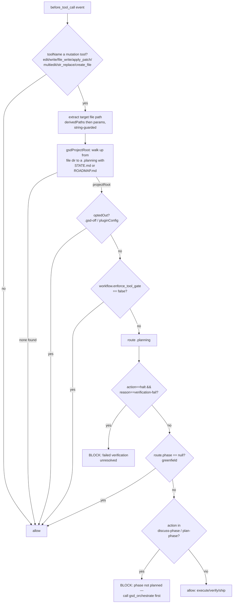

<!-- generated-by: gsd-doc-writer -->
# Enforcement Model

What turns GSD-OC from advisory prose into deterministic enforcement.

## The Problem: Advice Is Not Enforcement

Most "methodology" plugins are a pile of suggestions. They inject text into the
prompt — "remember to plan before you code", "follow the lifecycle" — and then
hope the agent obeys. The agent is free to ignore every word of it. There is no
mechanism that *stops* an out-of-order action; there is only a paragraph that
*asks* it not to happen.

GSD-OC takes the opposite position: the methodology is only real if the runtime
can **refuse** a violating action. The plugin therefore hangs its enforcement on
the OpenClaw `before_tool_call` hook, which is honored by the host:

- Returning `{ block: true, blockReason }` short-circuits the tool — it never
  executes, and the agent receives the reason.
- Returning `{ params }` rewrites the tool's arguments before it runs — the host
  applies the new params.

Those two host behaviors are the lever. Everything below is built on them.

The hook is registered in `src/index.ts:159-183` under the name
`gsd-oc:enforce-gate`. A single registration wraps **two** enforcement bodies —
the spawn-persona rewrite and the edit gate — inside one `try/catch` that
**fails OPEN**: any internal error is logged and returns `undefined` (allow), so
a bug in the gate can never brick every tool call gateway-wide
(`src/index.ts:163,177-180`).

```
before_tool_call (gsd-oc:enforce-gate)
  ├─ enforceSpawnPersona(event)   → returns {params} to rewrite a spawn, or void
  │     (runs first; ignores non-spawn tools)
  └─ enforceToolGate(event)       → returns {block:true} to refuse an edit, or void
        (runs when spawn returns void; ignores non-mutation tools)
```

## The Edit Gate (`enforceToolGate`)

`src/hooks/enforce-gate.ts:88-133`. A deterministic refusal of file-mutation
tools when the project is under GSD but planning for the current phase is not
done — or a verification has FAILED.

### What it gates

Only file-MUTATION tools are candidates
(`src/hooks/enforce-gate.ts:27`):

```
edit · write · file_write · apply_patch · multiedit · str_replace · create_file
```

Reads, exec, git, and the `gsd_*` tools are never blocked. The gate is matched
case-insensitively against the tool name; a non-mutation tool returns `void`
(allow) immediately at `src/hooks/enforce-gate.ts:93`.

### What it blocks on

The gate blocks in exactly two situations:

1. **A FAILED, unresolved verification** — `route()` returns
   `action:"halt", reason:"verification-fail"`. This is a hard halt and is
   checked *before* the greenfield guard, because both carry `phase:null` but
   only this one must block (`src/hooks/enforce-gate.ts:112-117`). The blockReason
   tells the agent to resolve the failed verification before editing more code.

2. **Phase not planned yet** — `route().action` is in `PRE_BUILD_ACTIONS`
   (`discuss-phase` or `plan-phase`, `src/hooks/enforce-gate.ts:30,123`). Editing
   code while the route still says *discuss* or *plan* is out-of-order GSD. The
   blockReason names the phase, the next GSD step, how to proceed
   (`gsd_orchestrate`), and the opt-out
   (`src/hooks/enforce-gate.ts:124-130`).

Everything else — `execute-phase`, `verify-work`, `complete-milestone`, etc. —
means planning is done, so the edit is allowed (`src/hooks/enforce-gate.ts:132`).

### Project scoping — why it never bricks the wrong thing

This is the part that makes the gate safe to ship. The gate is scoped to the
**edited file's** GSD project, not `process.cwd()` (which, in a gateway, is the
gateway home — not the project).

1. The target file path is extracted from the event — host-derived
   `derivedPaths[0]` first, then the params under any of `file_path`, `path`,
   `file`, `filePath`, `target_file`, `filename`. Every candidate is guarded to a
   non-empty **string** so an array-valued param or a non-string `derivedPaths[0]`
   can never reach `path.resolve` (which would throw) nor silently mis-scope
   (`src/hooks/enforce-gate.ts:33,38-47`).

2. `gsdProjectRoot()` walks **up** from the edited file's directory looking for an
   ancestor whose `.planning/` directory carries a real GSD marker — `STATE.md`
   **or** `ROADMAP.md` (`src/hooks/enforce-gate.ts:56-72`). Requiring a marker,
   not bare `.planning/` existence, is deliberate: a **stray** `.planning`
   (e.g. `~/.planning/research` with no roadmap) must not be mis-detected as a
   project. Without this guard, enforcement mis-fired gateway-wide whenever cwd
   was the gateway home — a live cross-contamination plus a pathless-write
   landmine. A *file* named `.planning` never anchors, because the check is
   `statSync(...).isDirectory()`.

3. If the edit is not inside any GSD project, `gsdProjectRoot` returns `undefined`
   and the gate returns `void` (allow) at `src/hooks/enforce-gate.ts:100`. This is
   what keeps greenfield, non-GSD, and post-planning work flowing untouched.

### Opt-outs and fail-open

After scoping, two opt-outs are consulted before any block:

- `.gsd-off` marker or host `pluginConfig` — via `optedOut(...)`
  (`src/hooks/enforce-gate.ts:102`, logic in `src/engage/opt-out.ts:65-75`). The
  `.gsd-off` check walks up to the project root, so a marker placed anywhere in an
  ancestor suppresses the gate for a subdirectory edit.
- `workflow.enforce_tool_gate: false` in `.planning/config.json` — an explicit
  per-project disable (`src/hooks/enforce-gate.ts:105-106`).

And the greenfield guard: when `route()` returns `phase == null` (no roadmap /
no phases), the gate returns `void` — there is no plan structure to enforce
against, and blocking would brick a fresh project. The auto-engage prompt nudges
toward `gsd_orchestrate` instead (`src/hooks/enforce-gate.ts:118-121`).

Finally, the whole body runs inside the `try/catch` in `src/index.ts:163-180`,
so any unexpected throw **fails open**.

### Decision flow



## The Spawn Persona Injection (`enforceSpawnPersona`)

`src/hooks/enforce-gate.ts:163-191`. The second enforcement body. It guarantees
that any subagent spawned **inside a GSD context** carries a GSD role contract —
never a bare, instruction-less subagent.

It intercepts the spawn tools (`src/hooks/enforce-gate.ts:136`):

```
sessions_spawn · subagents · task · spawn_agent
```

Flow:

1. Match a spawn tool (else `void`).
2. Scope to a real GSD project: `gsdProjectRoot(cwd)` must find a `.planning`
   ancestor, else the spawn is left untouched — GSD personas are never injected
   into non-GSD agents' spawns (finance/legal/etc.)
   (`src/hooks/enforce-gate.ts:171-172`).
3. Honor the same opt-outs (`src/hooks/enforce-gate.ts:173`).
4. Read the task text from `message`, `task`, or `prompt`. If it already carries
   a persona (`GSD subagent` or `gsd-oc:persona` marker present), leave it —
   **idempotent** (`src/hooks/enforce-gate.ts:176-178`).
5. Infer the persona from the task text via ordered, first-match-wins regex rules
   (`ROLE_RULES`, `src/hooks/enforce-gate.ts:139-156`):

   | Intent signal | Persona |
   |---|---|
   | research / investigate / domain / framework / api docs | `gsd-phase-researcher` |
   | map / codebase / architecture | `gsd-codebase-mapper` |
   | plan / plan-check / breakdown | `gsd-planner` |
   | debug / flaky / fail / broken / crash / bug | `gsd-debugger` |
   | secur / vulnerab / threat / audit / harden | `gsd-security-auditor` |
   | ui / frontend / component / design contract | `gsd-ui-researcher` |
   | eval / ai-integration / llm / agent quality | `gsd-eval-planner` |
   | review / code review | `gsd-code-reviewer` |
   | verif / validate / goal-backward | `gsd-verifier` |
   | document / docs / readme | `gsd-doc-writer` |
   | execut / implement / build / scaffold | `gsd-executor` |
   | (no match) | `gsd-executor` (default) |

   The default is still a GSD persona — `gsdRoleFor` never returns nothing
   (`src/hooks/enforce-gate.ts:153-156`).

6. Resolve the persona prompt and **prepend** it to the task, writing back into
   the *same key* the instruction came from (precedence `message` → `task` →
   `prompt`, default `message`). Writing to a fresh `message` key when only
   `prompt` was present would have left the real instruction untouched — the key
   is chosen by presence to avoid that (`src/hooks/enforce-gate.ts:189-190`).

The result is `{ params }` — the host applies the rewrite — so a mid-GSD spawn
always carries its role contract.

## The Route State Machine — the Enforcement Brain

`src/engine/route.ts`. Both enforcement bodies defer the *decision of what is
allowed* to one pure function: `route(planningDir)`. It reads `STATE.md` and the
phase artifacts on disk and returns the authoritative next action — same inputs,
same route, no writes, no `process.exit` (`src/engine/route.ts:202-311`).

It reproduces the GSD `next.md` route table:

- **Hard-stop gates** fire first: an unresolved `.continue-here.md` checkpoint
  (`:205-207`), an `error`/`failed` status (`:208-212`), and an unresolved
  VERIFICATION FAIL (`:217-219`). The edit gate keys on this last one to block.
- **Route 0** resumes an incomplete phase (`:221-229`).
- **Routes 1-8** walk the roadmap phases in order and return the first
  incomplete one's action — `discuss-phase`, `plan-phase`, `execute-phase`,
  `verify-work`, `complete-milestone` (`:231-310`).

Three verdict readers parse the GSD `**Status:**` bold convention consistently —
this is what makes the gate's verdicts reliable:

- `readStatus` (`src/engine/route.ts:54-78`) — frontmatter `status:` baseline,
  overridden by a body `**Status:**` / `Status:` in `## Current Position`; quotes
  stripped on both branches so `Status: "failed"` halts.
- `hasUnresolvedVerificationFail` (`src/engine/route.ts:113-158`) — strips
  markdown bold before matching so `**Status:** FAILED` (the standard verifier
  verdict form) is caught, while negations, resolutions, and override-marked lines
  are ignored.
- `verificationPassed` (`src/engine/route.ts:164-200`) — same bold-strip so
  `**Status:** PASSED` is recognized; anchored to a field value or a delimited
  table cell so a `# PASSED` heading is never a false positive.

All three mirror each other's bold handling on purpose: if one honored a
bold-field PASS while another missed a bold-field FAIL, a failed phase could ship
past the hard-stop gate (`src/engine/route.ts:133-137`).

## Auto-Engage — Injecting the Policy

Enforcement refuses violating *actions*; auto-engage makes the agent aware of the
methodology in the first place. It is delivered two ways.

**Canonical path — `agent:bootstrap`** (`src/index.ts:190-193`,
`src/engage/bootstrap-inject.ts`). This internal hook fires on the embedded /
gateway agent path and is backed by the same runner the agent runtime consults,
so it is not wiped by per-load hook-runner re-init. It owns the order-10
`AGENTS.md` bootstrap file — the one that survives subagent filtering — and merges
the imperative GSD policy block into it (`decideBootstrapInjection`,
`src/engage/bootstrap-inject.ts:56-75`). It is gated to a coding workspace
(`isCodingWorkspace`) and the opt-outs, and is idempotent via the `gsd-oc:begin`
marker (`src/engage/bootstrap-inject.ts:42-44,60-61`). If no AGENTS entry exists,
it synthesizes one.

**Prompt path — `before_prompt_build`** (`src/index.ts:138-147`,
`src/hooks/auto-engage.ts`). For coding-workspace intents it prepends the
`GSD_META_PROMPT` (`src/hooks/auto-engage.ts:68-73,120`). Engagement requires all
of: a coding workspace (under `~/codeWS` or carrying a `.git`/`package.json`/
`.planning`/etc. marker, root-agnostic), a coding intent (`classifyIntent`), and
no opt-out (`src/hooks/auto-engage.ts:115-119`). Trivial chat is never hijacked.

Operator gates apply: prompt injection requires
`hooks.allowPromptInjection: true`; the plugin never mutates host config.

## Honest Limitations

- **Tool-execute context lacks `workspaceDir`.** The `gsd_state` and
  model-routing tools resolve their project with a best-effort
  `gsdProjectRoot(process.cwd())` walk (`src/index.ts:326-327`). When cwd is not
  the workspace (e.g. the gateway home), this falls back to a cwd-relative
  `.planning`. The robust state-advance channel is `agent_end` (which carries
  `workspaceDir`), tracked as **SDK-03**.

- **Per-session toggle read-back is gateway-gated.** The `before_prompt_build`
  context exposes no `getSessionExtension` reader (that reader lives only on the
  tool context). So the per-session on/off toggle's live read-back is not cleanly
  available from the prompt hook this release; `.gsd-off` and host `pluginConfig`
  are the authoritative opt-outs. Full read-back is deferred to a later phase
  (`src/hooks/auto-engage.ts:92-98`, `src/index.ts:116-130`).

- **Enforcement is hook-honored, not kernel-enforced.** It depends on the
  OpenClaw host honoring `{block:true}` / `{params}` from `before_tool_call`. The
  plugin verifies that contract at registration but cannot enforce a tool the host
  declines to route through the hook.
